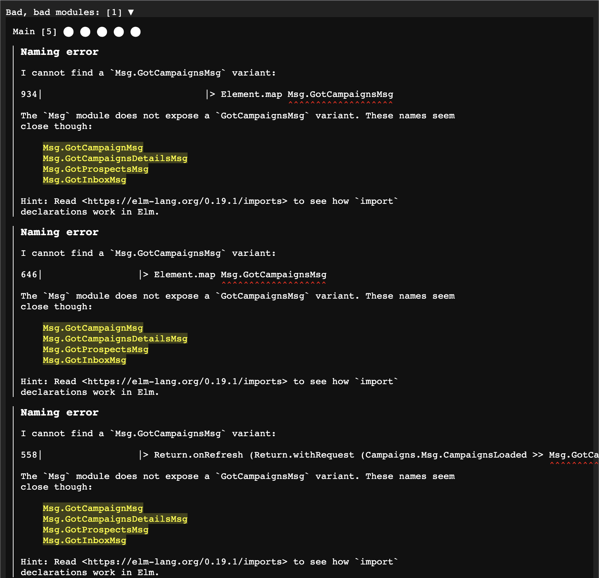

# Elm interReactor
An elm reactor that allows you to apply the suggestions included in the report of the elm compiler.

:warning: **This is experimental software. Please commit your files before using this tool and be aware of the known issues.**

## Known issues
- sometimes the report for the first compilation is not loaded / stale data is presented. Reloading the browser helps.
- end of imports can not be detected, adding an import fails silently
- field names sometimes are suggested on type problems with records

## Rationale
As a terminal user, I find myself often just applying suggestions from the elm compiler by reading the line number and applying the fix.
Because copying from the output is cumbersome I type the changes manually and make mistakes.
This tool automates the process.

## Demo (click to play)
[](https://user-images.githubusercontent.com/7485959/120943953-f0a71380-c729-11eb-8db8-e270953bfb0b.mp4)
## Usage
```
cd same-directory-as-elm-json
npx @funk-team/elm-interreactor
```
